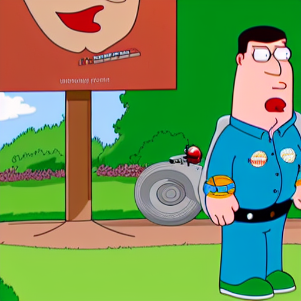

# Family Guy Style LoRA Model with Stable Diffusion

## Project Description

This project aims to train and use a LoRA (Low-Rank Adaptation) model on Stable Diffusion v1.5 that can emulate the distinctive visual style of the popular cartoon series "Family Guy". The project involves training LoRA with a custom dataset and using the trained LoRA model to generate Family Guy style images from text prompts.

This work was developed and tested using Notebooks on the [Kaggle](https://www.kaggle.com/) platform.

## Features

* **LoRA Training:** Kaggle Notebook showing how to train a LoRA model with provided Family Guy images and textual descriptions (caption).
* Generate Images from Text:** Load the trained Family Guy LoRA model into a Stable Diffusion pipeline to create new images in the Family Guy aesthetic using a specified trigger word (`familyguy style`).
* **Kaggle Compatibility:** Codes and scripts are optimized to run in Kaggle environment (with GPU).

## Technology Stack

* Python 3. x
* PyTorch
* Hugging Face Diffusers
* Hugging Face Accelerate
* Hugging Face Transformers
* bitsandbytes (for 8-bit Adam optimizer)
* Kaggle Notebooks & GPU
* Stable Diffusion v1.5 (as main model)
* LoRA (as fine-tuning technique)

#### 1. LoRA Training Notebook

1. **Prerequisites:**
 * A Kaggle account.
    * Make sure GPU (T4 or P100 recommended) is enabled in the Notebook settings.
2. **Libraries:** Install the necessary libraries (`diffusers`, `accelerate`, `bitsandbytes`, `transformers` etc.) by running the cells at the beginning of the notebook and clone the `diffusers` repo.

3. **Dataset:**
 * Add the dataset containing Family Guy images (`.jpeg`, `.png`) and matching `.txt` caption files [from Kaggle](https://www.kaggle.com/datasets/oulcanakca/family-guy-lora-data/data).
    * Make sure that the `.txt` files contain the trigger word (e.g. `familyguy style`). If necessary, add the trigger word using the preparation script in the Notebook.

### 2. Training the LoRA Model

1. **Open the Training Notebook:** Open the Kaggle Notebook you prepared for the LoRA training.
2. **Data Preparation:** Load your data set and run the preparation scripts (adding trigger word, creating a folder with only images) if necessary.
3. **Set Parameters:** Check the `export` commands in the `%%bash` cell:
    * `INSTANCE_DATA_DIR`: Make sure it shows the path to the folder with the (cleaned) image files (e.g. `/kaggle/working/family_guy_images_only`).
    * `OUTPUT_DIR`: Specify the path to save the trained model (e.g. `/kaggle/working/familyguy-lora-output`).
    * `INSTANCE_PROMPT`: Make sure it contains the trigger word (e.g. `"a photo in familyguy style"`).
    * Set other parameters (`MAX_TRAIN_STEPS`, `LEARNING_RATE`, `RANK` etc.) according to your wishes.
4. **Start Training:** After running the required setup and preparation cells, run the training cell starting with `%%bash`.
5. **Get the Result:** When the training is complete, you will have a LoRA file with `.safetensors` extension in the folder you specified as `OUTPUT_DIR`. Save or download this file.

### 3. Generating Images with Trained LoRA

1. **Prepare a Prompt:** Go to the "Text-to-Image" (or similar) tab and type your prompt. Always use the trigger word you used in the tutorial (`familyguy style`) at the beginning or inside your prompt.
    * Example Prompt: `familyguy style, a cat wearing a wizard hat, detailed illustration`
2. **Generate Image:** Make other necessary settings (number of steps, guidance scale, etc.) and click on the generate image button. The model is expected to generate a Family Guy style image.

## Dataset

In this project, approximately 25 images from the Family Guy cartoon series were used. The images have a resolution of 512x512 pixels. For each image, there is a short text description (`.txt` file) containing a trigger word (`familyguy style`).

## Sample Results

*Prompt: familyguy style a futuristic robot standing in a park*

## Possible Enhancements

* Retrain the LoRA model with more and diverse data.
* Experiment with different Stable Diffusion master models (SD 2.1, SDXL, etc.).
* To investigate the effect of different LoRA rank (`RANK`) and learning rate (`LEARNING_RATE`) values.
* To optimize the number of training steps (`MAX_TRAIN_STEPS`).
